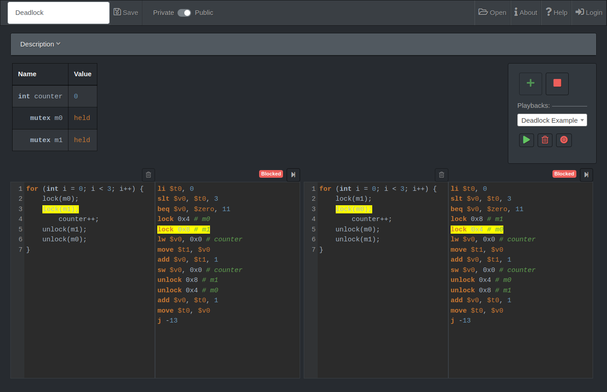

# Multithreading Demo

This project allows you to experiment with and demonstrate concurrency, the various problems it can cause, and solutions to those problems.  You can demonstrate race conditions, deadlock, and synchronization primitives such as locks, condition variables and semaphores. Click "Open" in the top right to view an index of demo examples, or to create your own.



## Online Demo
An online demo, minus the database portion, is available at https://jesse-r-s-hines.github.io/MultithreadingDemo/Demo.html

## Tools

In order to fullfil requirements for several school projects, the demo uses several different tools.
The backend server is written using C# [ASP.NET Core](https://docs.microsoft.com/en-us/aspnet/core) and [Entity Framework Core](https://docs.microsoft.com/en-us/ef/). The client side is written using [Scala.js](https://www.scala-js.org/) and uses the [Nearley](https://nearley.js.org/) library for parsing.

## Building

To build the project you'll need [sbt](https://www.scala-sbt.org/), [node](https://nodejs.org/en/), [npm](https://www.npmjs.com/get-npm), and [.NET Core](https://dotnet.microsoft.com/download).

You can run the Makefile in a bash shell to launch the server locally. 
```
make run
```

### Using Docker Image
There is also a Docker image you can use to run the app with all its dependencies. Simply run

```
docker-compose build
docker-compose up
```
and go to `http://localhost:8080/Multithreading` in your browser.

The database will be persisted in the named volume `multithreadingdemo_db`.

## Usage

### Basic Usage

A demo has two main sections, one globals section which is at the top, and one or more threads side by side at the bottom of the screen. You can have as many threads as you want, and can make your own programs. All of the threads can read and write to variables defined in the globals section, but threads can't access each other's data.

Once you have some code in the globals and threads sections, you can run the demo. You will see a compiled version of the code next to each thread, in MIPS-like assembly.  You then act as the scheduler yourself, allowing you to control the exact order each thread gets executed in. You use the "step" button above each thread to move one instruction forward in its execution. 

To be able to save a demo permanently you'll need to log in and make an account. Then, make sure to hit "Save" before you leave, so you don't have to remake the demo! 

### The Language

The language you can use is mostly a sub-set of C. You can set and modify variables, do arithmetic, and preform loops and conditionals.  It can recognize 5 variable types: int, bool, mutex, cond_var, and sem.

You can use any of the 3 synchronization primitives, mutexes, condition variables, and semaphores. The following procedures and functions are available to work with them:

* lock(mutex m)
    Tries to aquire the given mutex. If the mutex is free, it will be marked as held and the calling thread will continue into the critical section. If the mutex is already held, the thread will block until it becomes available.

* unlock(mutex m)
    Releases the given mutex so that another thread can enter the critcal section.

* cond_wait(cond_var c)
    Blocks the calling thread until another thread calls cond_signal on the same cond_var. Unlike C's  pthread_cond_wait you don't need to surround the call to cond_wait with a mutex.

* cond_signal(cond_var c)
    Wakes all threads that were waiting on the given condition variable. Unlike C's pthread_cond_signal you don't need to surround the call to cond_wait with a mutex.

* sem_create(int value)
    Creates and returns a semaphore with the given initial value.

* sem_wait(sem s)
    If the value of s is 1 or greater, it will decrement the value of s and the calling thread will continue forward right away. If s's value is 0 or less it will decrement the value of s and block until it is released by a call to sem_post on the same semaphore by another thread.

* sem_post(sem s)
    Increments the value of s, and if there are any threads waiting on the given semaphore, it will wake one. If there is more one thread waiting on the semaphore, it will give the user the option to choose one to wake.    
    
### Examples

```c
int counter = 1 + 6 / 2;
bool b = true;
mutex m;
cond_var c;
sem s = sem_create(1);

for (int i = 0; i < 10; i++) {
    lock(m);
        counter++;
    unlock(m);
}

int j = 0;
while (j < 10) {
    sem_wait(s);
        counter++;
    sem_post(s);
}

cond_signal(c);
cond_wait(c);
```

### Playbacks

Once your have a demo set up, you may have specific paths of execution through the threads that cause whatever  problem or situation you are trying to demonstrate.   You can record those specific play throughs, and then play them back later.  Use the record button, and then step through the threads as you would normally. When you are finished press the stop recording button and it will let you name and save the recorded playback. You can have multiple playbacks if you want.  To replay the playback, select it from the playback dropdown and hit the play playback button (below the dropdown).

## Author

This project was made by Jesse Hines in 2020 for the Database, Organization of Programming Languages and Operating Systems classes at Southern Adventist University.


